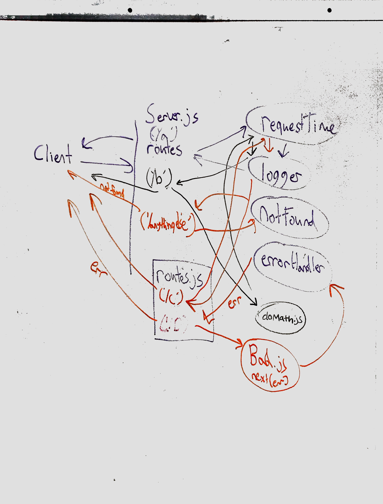

#  LAB

## Lab-07-api-server

### Author: Chris and Bonnie

### Links and Resources

- [submission PR](http://xyz.com)
- [travis](https://www.travis-ci.com/401-advanced-javascript-bw/lab-07-api-server)

#### Documentation

- [api docs](http://xyz.com) (API servers)
- [jsdoc](http://xyz.com) (Server assignments)
- [styleguide](http://xyz.com) (React assignments)

### Modules

#### `server.js`

#### `validatePost.js`

##### Exported Values and Methods

###### `validatePost(req,res,next) ->`

Usage Notes or examples

###### `bar(array) -> array`

Usage Notes or examples

### Setup

- Listen on `PORT 8080`

#### Running the app

- `npm i`
- `nodemon`
- Endpoint: `/categories`
  - Returns a JSON object with name data.

#### Tests

- run `npm test` to run tests.
- Rejects if req.body keys do not match schema keys
- Accepts req.body if all keys match schema

#### UML

